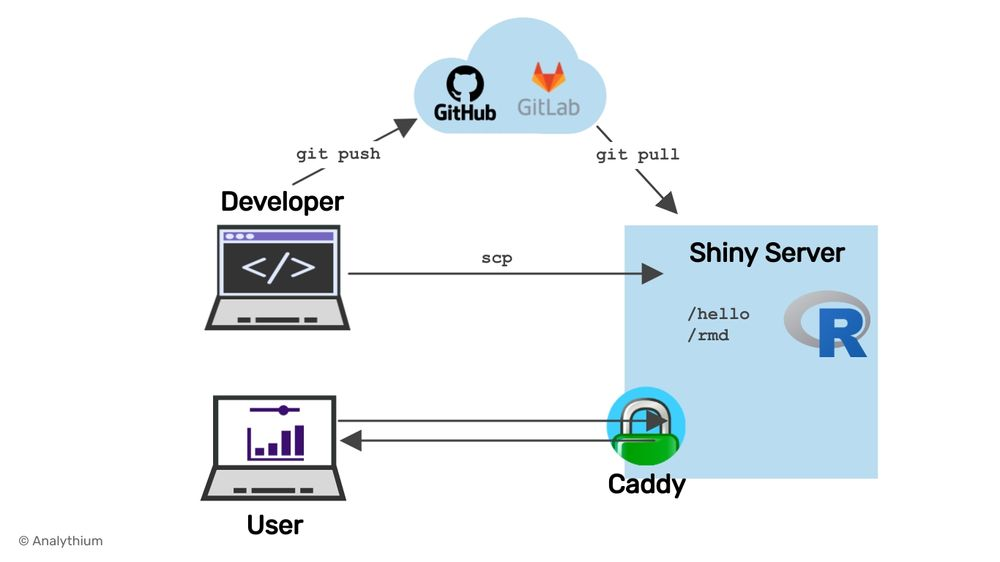

+++
lastmod = 2025-09-17T13:00:00Z
publishDate = 2025-09-12T10:00:00Z
title = "shiny-server"
tags = []
+++

## 虚拟机或物理机安装ubuntu 22.04，或云服务器

创建用户的时候取一个中性的名字，该用户具有sudo权限用来执行用户管理等  
比如systemadmin (admin是系统自带的，会冲突)  

## 配置网络

询问网络管理员

## 安装ssh服务

sudo apt-get update  
sudo apt-get install openssh-server  
查看ssh服务是否开启  
service ssh status  
如果不是active(running)就启动服务  
sudo service ssh restart  
在windows上win+R运行cmd, ubuntu的ip地址是网络管理员给的, 个人的话自己家里的网络，用`ip a`查看，inet就是ip地址  
ssh admin@ip  
第一次进去要先yes，然后输入密码，现在可以在windows上通过命令行操作linux  

## ubuntu内搭建shiny-server

官网教程[https://posit.co/download/shiny-server/](https://posit.co/download/shiny-server/)  

1. 安装R

   直接按照教程里的`sudo apt-get install r-base`安装的R不是最新版的，为了装上最新版本的R，需要多一些操作，参照cran的[offical guide](https://cran.r-project.org/bin/linux/ubuntu/)  

   ```
   # update indices
   sudo apt update -qq
   # install two helper packages we need
   sudo apt install --no-install-recommends software-properties-common dirmngr
   # add the signing key (by Michael Rutter) for these repos
   # To verify key, run gpg --show-keys /etc/apt/trusted.gpg.d/cran_ubuntu_key.asc 
   # Fingerprint: E298A3A825C0D65DFD57CBB651716619E084DAB9
   wget -qO- https://cloud.r-project.org/bin/linux/ubuntu/marutter_pubkey.asc | sudo tee -a /etc/apt/trusted.gpg.d/cran_ubuntu_key.asc
   # add the R 4.0 repo from CRAN -- adjust 'focal' to 'groovy' or 'bionic' as needed
   sudo add-apt-repository "deb https://cloud.r-project.org/bin/linux/ubuntu $(lsb_release -cs)-cran40/"
   ```

   ```
   sudo apt install --no-install-recommends r-base
   ```

2. 安装Shiny Server

   ```
   # 安装依赖
   sudo apt-get install gdebi-core  
   # 下载shiny-server
   wget https://download3.rstudio.org/ubuntu-18.04/x86_64/shiny-server-1.5.22.1017-amd64.deb  
   # 安装
   sudo gdebi shiny-server-1.5.22.1017-amd64.deb
   ```

3. 安装shiny

   shiny-server安装以后会自动创建一个名为shiny的用户，shiny-server默认是用shiny用户运行的，所以如果是其他用户安装的R包，shiny是没有权限执行的

   为避坑，先提前安装一些必要的library

   `sudo apt-get install build-essential`， 否则会`sh: 1: make: not found`  
   `sudo apt-get install zlib1g-dev`，否则会安装不了`httpuv`(shiny的一个依赖包)  

   用shiny用户安装shiny
   ```
   sudo su - shiny
   R
   install.packages('shiny', repos='https://cran.rstudio.com/')
   yes
   yes
   q()
   n
   exit
   ```

   测试安装成功没  
   ```
   sudo su - shiny -c "R -e \"packageVersion('shiny')\""
   ```
   显示版本号就好了

   官网的做法是为用root权限为所有用户安装包
   ```
   sudo su - \ -c "R -e \"install.packages('shiny', repos='https://cran.rstudio.com/')\""
   ```

   教程里似乎忘记换行了？？会提示`su: 用户 -c 不存在`，分两次执行以下  
   ```
   sudo su - \
   -c "R -e \"install.packages('shiny', repos='https://cran.rstudio.com/')\""
   ```
   
   或者执行以下行  

   ```
   sudo su - -c "R -e \"install.packages('shiny', repos='https://cran.rstudio.com/')\""
   ```

4. 测试Shiny server

   在ubuntu上进入localhost:3838看到欢迎页面，localhost:3838/sample-apps/hello/是一个简单的shinyapp

5. 安装nginx

   sudo apt-get update  
   sudo apt-get -y install nginx  

6. 部署自己的app

   1. 访问成功后，就可以把你的shiny项目放在/srv/shiny-server这个目录下（一般默认是这个目录），比如test文件夹包含标准的shiny结构，那你就可以ip:3838/test然后就能访问你用shiny写的网站了。  

      

      1. 首先会有移动文件等权限问题，让xiaoming等其他普通用户也能上传自己的app  
         @dettli  
         首先添加用户组  
         sudo groupadd shiny-apps  
         sudo usermod -aG shiny-apps shiny  
         向里面加入想贡献app的xiaoming等其他普通用户  
         新建用户  
         sudo useradd -m xiaoming  
         或者创建时就为他指定shell工具  
         sudo useradd -m -s /bin/bash xiaoming  
         后期改shell的话  
         sudo usermod -s /bin/bash xiaoming  
         设定xiaoming的密码  
         sudo passwd xiaoming  
         sudo usermod -aG shiny-apps xiaoming  
         将/srv/shiny-server文件夹下的所有文件的拥有者设为 shiny，群体的使用者 shiny-apps :  
         sudo chown -R shiny:shiny-apps /srv/shiny-server  
         在该目录下创建的文件都属于该目录所属的组  
         sudo chmod g+w /srv/shiny-server  
         sudo chmod g+s /srv/shiny-server  

      2. 不同的上传途径
         1. xiaoming在windows端开发，通过scp上传文件到linux
            在windows的cmd中  
            scp -P 10022 -r d:/shiomix/app/ xiaoming@10.10.51.122:/srv/shiny-server/shiomix
            ssh xiaoming@10.10.51.122  
            在linux中  
            mv shiomix /srv/shiny-server/shiomix  
            ls -l /srv/shiny-server  
            可以看到shiomix文件夹是属于用户xiaoming的，属于用户组shiny-apps的  
         2. xiaoming在windows开发，上传到github (提前让sudo用户安装git `sudo apt-get -y install git`)
            克隆仓库  
            git clone 仓库地址  
            放到/srv/shiny-server/下  
            cp -r folderpath /srv/shiny-server/  
         3. xiaoming直接在linux上开发


   2. 运行不成功大多是包的问题

      记住所有包都要用shiny用户安装
      ```
      sudo su - shiny -c "R -e \"install.packages('packagename', repos='https://cran.rstudio.com/')\""
      ```
      - 一些常见包的安装问题  
      ```
      * installing *source* package ‘curl’ ...
      ** package ‘curl’ successfully unpacked and MD5 sums checked
      ** using staged installation
      Package libcurl was not found in the pkg-config search path.
      Perhaps you should add the directory containing `libcurl.pc'
      to the PKG_CONFIG_PATH environment variable
      No package 'libcurl' found
      Package libcurl was not found in the pkg-config search path.
      Perhaps you should add the directory containing `libcurl.pc'
      to the PKG_CONFIG_PATH environment variable
      No package 'libcurl' found
      Using PKG_CFLAGS=
      Using PKG_LIBS=-lcurl
      --------------------------- [ANTICONF] --------------------------------
      Configuration failed because libcurl was not found. Try installing:
      * deb: libcurl4-openssl-dev (Debian, Ubuntu, etc)
      * rpm: libcurl-devel (Fedora, CentOS, RHEL)
      If libcurl is already installed, check that 'pkg-config' is in your
      PATH and PKG_CONFIG_PATH contains a libcurl.pc file. If pkg-config
      is unavailable you can set INCLUDE_DIR and LIB_DIR manually via:
      R CMD INSTALL --configure-vars='INCLUDE_DIR=... LIB_DIR=...'
      -------------------------- [ERROR MESSAGE] ---------------------------
      <stdin>:1:10: fatal error: curl/curl.h: No such file or directory
      compilation terminated.
      --------------------------------------------------------------------
      ERROR: configuration failed for package ‘curl’
      * removing ‘/home/shiny/R/x86_64-pc-linux-gnu-library/4.3/curl’
      ```

      如此情况，运行sudo apt-get install libcurl4-openssl-dev

7. 虚拟机暴露到局域网内

   现在其他pc还不能访问shinyserver，不够方便  
   vmware软件的左上角，编辑，虚拟网络编辑器，点右下角更改设置，选第一个VMnet0，已桥接至选择当前用的网卡，有线选有线，无线选无线  
   更改虚拟机的设置，网络适配器，网络连接改桥接模式，进入ubuntu的设置，网络，有限，ipv4，方式改为手动，地址和DNS填写和物理机一模一样的，重启一下，期间可能会看到很多打印机添加进来，能不能上网还得上个www.baidu.com看看

## 充分利用linux系统

1. 管理用户组

   sudo groupadd -g 7777 student  
   查看，在最后一行可以看到`student:x:7777`  
   cat /etc/group  
   添加用户xiaoming到student组  
   sudo usermod -aG student xiaoming  

2. Anaconda

   下载  
   wget https://repo.anaconda.com/archive/Anaconda3-2024.02-1-Linux-x86_64.sh  
   安装  
   sudo bash ./Anaconda3-2024.02-1-Linux-x86_64.sh  
   enter下去，到同意条款  
   yes  
   问安装路径，输入
   /opt/anaconda3  
   问是否初始化conda  
   no  
   为了让其他用户也能用conda，之前我们已经有student用户组了，mygroup可以替换为student，让所有student组的用户都能用conda  
   sudo groupadd mygroup  
   sudo chgrp -R mygroup /opt/anaconda3  
   sudo chmod 770 -R /opt/anaconda3  
   记得把新创建的用户也加到mygroup用户组里  
   sudo usermod -aG mygroup xiaowang  

   xiaowang每次想要用conda的时候，都要先  
   source /opt/anaconda3/bin/activate  
   最好不要修改base!!!


## nginx配置

```
sudo nano /etc/nginx/sites-enabled/default
```

在`server_name _;`这一行下面添加  
```
location /shiny/ {
   proxy_pass http://localhost:3838/;
   proxy_http_version 1.1;
   proxy_set_header Upgrade $http_upgrade;
   proxy_set_header Connection $connection_upgrade;
   rewrite ^(/shiny/[^/]+)$ $1/ permanent;
   client_max_body_size 300M;
}
```

`client_max_body_size`是允许上传的文件大小, 要和shiny中设置的一样  